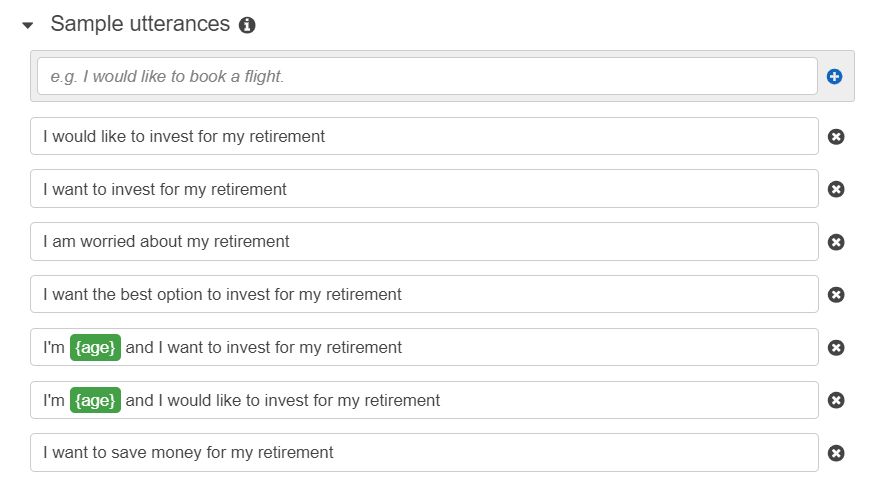

# Robo Advisor - Module 15 Challenge

This is a robo advisor that has been created to engage both existing and new customers.  A customer can consult the advisor to obtain investment recommendations for their retirement.

---

## Technologies

The robo advisor leverages Python 3.7 and json files along with the following:

* [AWS_Console](https://aws.amazon.com/console/) - Amazon Lex (to create the bot) and Amazon Lambda (to validate the customer inputs and return a recommendation)

---

## Installation Guide

    from datetime import datetime
    from dateutil.relativedelta import relativedelta

---

## Usage

Creat the robo advisor using Amazon Lex using the following visuals.

Sample Utterances:

Slots:

To enhance the use of the robo advisor, sign into the Amazon Console.  Create a new Lambda Function using Python 3.7 named "recommendPortfolio."  Copy the lambda_function.py file from the Lambfa folder in the repository.  Next, create the following four tests using the code from the Test_Events folder in the repository (ageError, correctDialog, incorrectAmountError, negativeAgeError).

The test events will confirm the following:
    * The customer is older than 0 and younger than 65
    * The customer is going to invest an amount greater than $5,000

After the intents are fulfilled in the robo advisor, the customer will receive the following recommendations based on the level of risk they have selected.  

The investment recommendations are as follows:

    * **none:** "100% bonds (AGG), 0% equities (SPY)"
    * **low:** "60% bonds (AGG), 40% equities (SPY)"
    * **medium:** "40% bonds (AGG), 60% equities (SPY)"
    * **high:** "20% bonds (AGG), 80% equities (SPY)"

---

## Contributors

Brought to you by ABolla and her helpful tutor

---

## License

MIT

